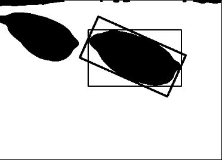

# Broken-Grain-Detection

## Discription

Grain breakage is an important factor that affects grain yield and quality. It is of great significance to do research on rice grain breakage identification and detection methods to promote green, high-yield, stable, high-quality and efficient development of rice. This project aims to automate the process of broken-graph-detection. Specifically, the digital image processing technology is used to extract the morphological feature parameters. Among various machine learning algorithms, the decision tree and random forests are proven to be simple but effective models.

## Method

### Image processing module

* Image pre-processing (singleimg.py). We first pre-process the raw image using the OpenCV library including grayscale, image enhancement, image segmentation, image denoising, and edge detection. 

### Original Grain
</img>
### Pre-processed Grain
</img>

* Feature Extraction that extracts morphological features such as rice grain sample area, perimeter, roundness, length, width, length-width ratio, rectangularity, density, etc. 

### Broken-graph detection (classification) module
Considering the training data
2. Using the decision tree, the Gini coefficient is selected as the segmentation metric of the decision tree node split, supplemented by the method of random forest for comparison, and finally the identification model of broken rice kernels is established.

## Data

We collected 177 complete grain samples and 39 broken grain samples. 

## Result and Analysis:

### Classification Result Using Single Feature
|             |train accuracy|test accuracy|  test F1    | test recall |test precision|
| :----------- | :------------ |:------------ |:------------ |:------------ |:------------ |
| Area      | 88.01 |	84.90|	69.40|	76.12|	68.85       |
| Perimeter   | 88.24	|85.79|78.46|	76.90	|84.37|
| Roundness   |82.16|	83.00	|45.31|	41.51|	49.98|
| Length      |85.10|	81.19	|71.74	|69.99|	80.41|
| Width       |84.25|	80.95|	56.13	|62.15	|56.76|
| Length-width Ratio|82.18|	83.05	|45.32|	41.54|49.97|
| Rectangularity|82.18|	83.05|	45.32|	41.54|	49.97|
| Dendity   |82.18|	83.05|	45.32|	41.54|	49.97|

### Broken Grain Detect Decision Tree
</img>
